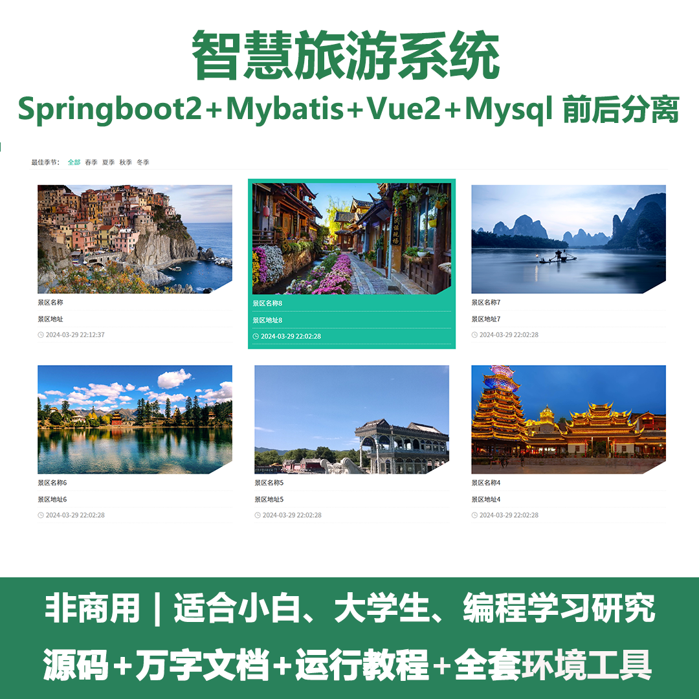
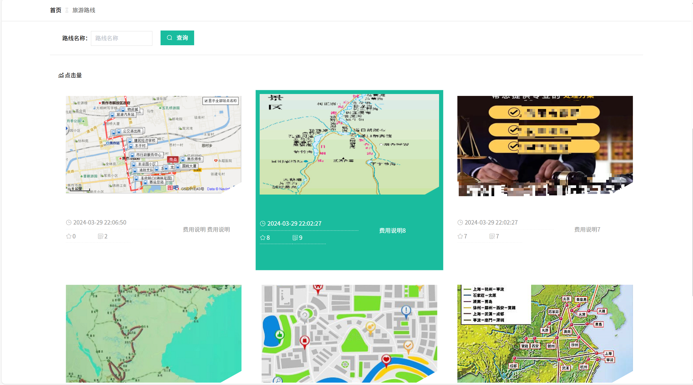
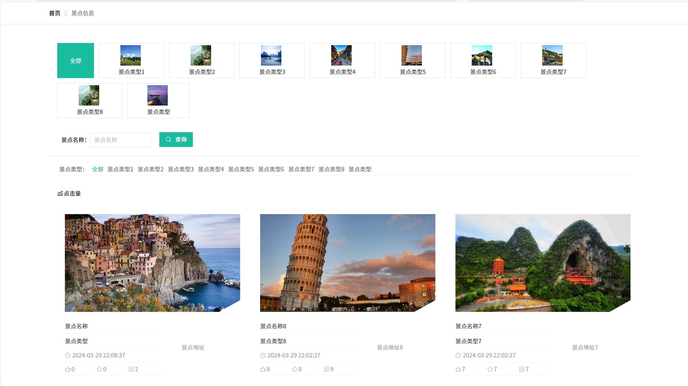
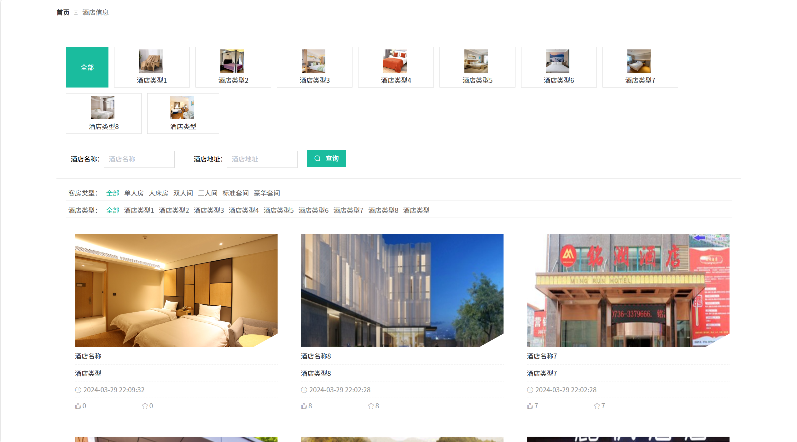
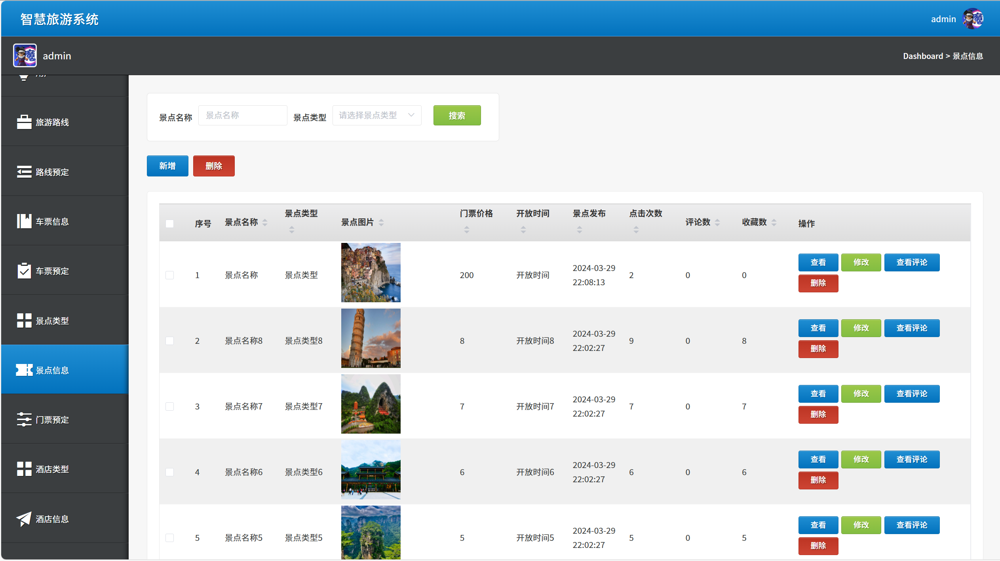
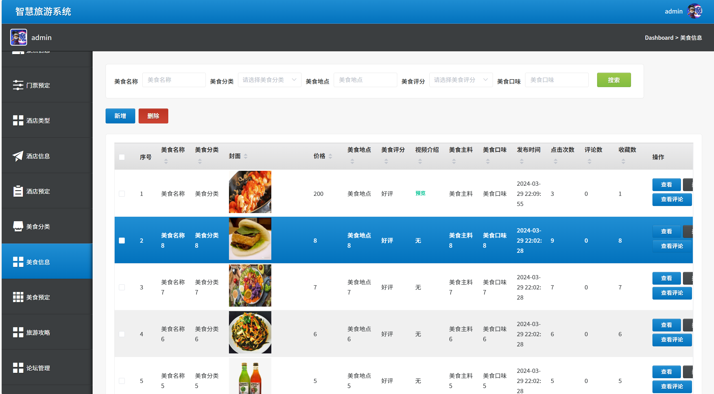
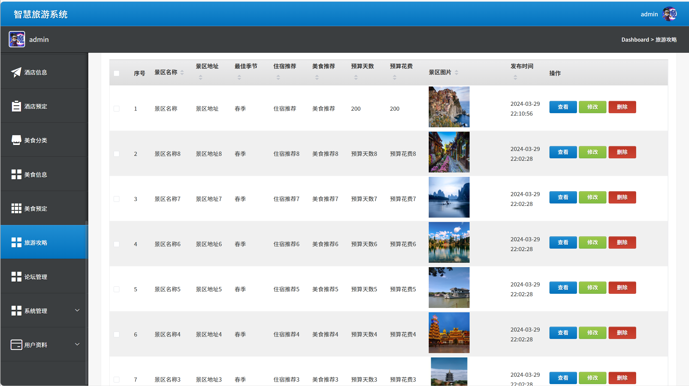
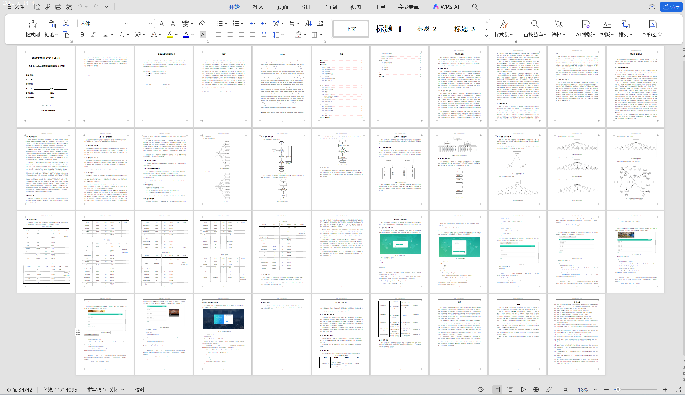

# springbootA414
springbootA414智慧旅游系统+LW
 
## 查看主页获取源码

### 一、关键词

智能旅游服务系统，数字旅游管理系统，智慧文旅综合平台
 

### 二、作品包含

源码+数据库+设计文档万字+全套环境和工具资源+部署教程

 

### 三、项目技术

前端技术：Html、Css、Js、Vue2.0、Element-ui 
后端技术：Java、SpringBoot2.0、MyBatis

  

 

### 四、运行环境（以下版本亲测，其他版本未知，请自测）

开发工具：IDEA/eclipse  + VSCODE

数据库：MySQL5.7（最低要5.7版本）

数据库管理工具：Navicat10以上版本

环境配置软件： JDK1.8 + Maven3.6.3

前端Nodejs：14

浏览器：谷歌浏览器

 

### 五、项目介绍

项目编号：springbootA414

以智慧旅游系统的设计与实现为研究对象，旨在通过科技手段提升旅游业的管理效能和游客体验。在系统设计方面，深入分析了地理特征、丰富的文化底蕴以及多样的自然景观。结合这些独特之处，构建了一个多层次的旅游管理系统，包括景点信息管理、美食信息、住宿预订、旅游攻略等功能，以实现全方位的旅游服务。在系统实现阶段，采用先进的信息技术和框架技术，除了使用了springboot框架确保系统的高效性和智能化外，还采用了MVC架构，将系统分层运行编写，提高了系统的可扩展性和灵活性。该系统不仅通过在线服务提供便捷的信息查询和预订功能，还通过个性化推荐系统为游客量身定制旅游路线，提升游览体验。同时注重系统的实时更新机制，以确保游客获取到最新的景点信息、路线信息等关键数据，从而更好地规划行程。创新整合了社交媒体的分享功能，通过论坛的形式让用户可以方便地分享自己的旅游经历和感受，扩大了系统的影响力和用户群体

### 六、运行截图

